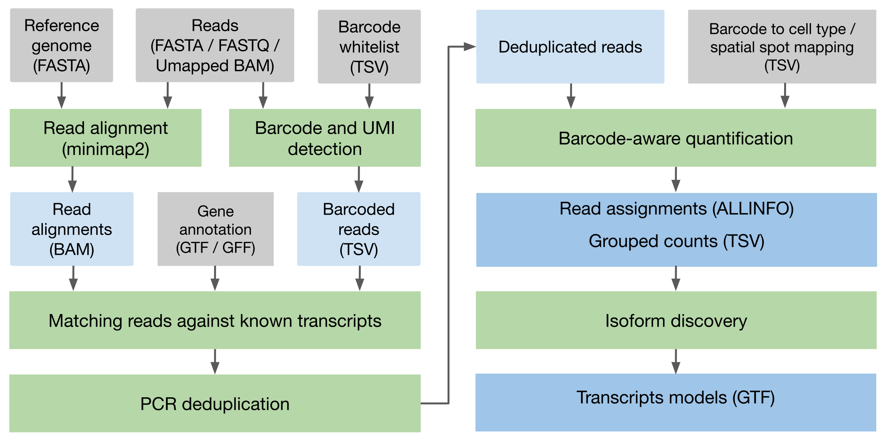

# About Spl-IsoQuant

Spl-IsoQuant is a tool for **single-cell and spatial long-read transcriptomics** analysis.
It performs genome-based analysis of long RNA reads from platforms such as PacBio or
Oxford Nanopore, with specialized support for single-cell and spatial protocols.
Spl-IsoQuant is capable of perfroming barcode and UMI detection for various sequencing protocols, 
UMI deduplication and barcode-aware quantification of reads, where reads are grouped
(e.g. according to cell types or spatial location), counts are reported according to the provided grouping.
We recommend providing smaller barcode whitelists (e.g. obtained from short-read sequencing) to achieve higher accuracy. 

Similarly to IsoQuant, it can also perform novel transcript discovery. 
However, in single-cell/spatial mode, Spl-IsoQuant will only discover 
novel isoforms for known genes, as reads that are not assigned to any 
known gene are discarded during the PCR deduplication step. 
To achieve full transcript discovery, run Spl-IsoQuant in bulk mode.

Latest Spl-IsoQuant version can be downloaded from [https://github.com/algbio/spl-IsoQuant/releases/latest](https://github.com/algbio/spl-IsoQuant/releases/latest).

### Spl-IsoQuant pipeline

